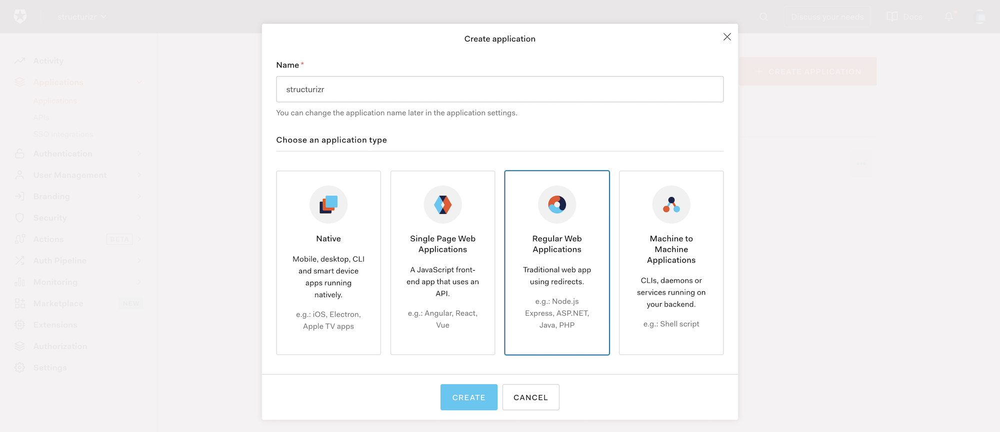
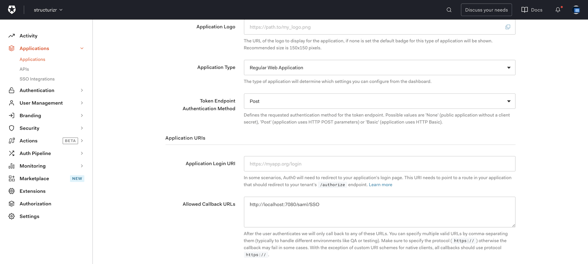
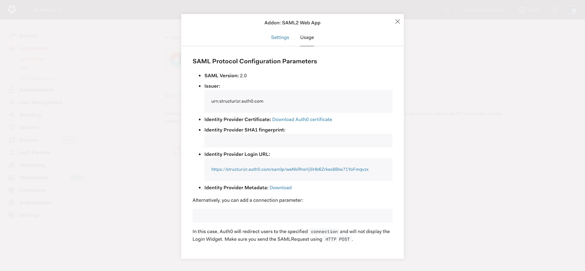
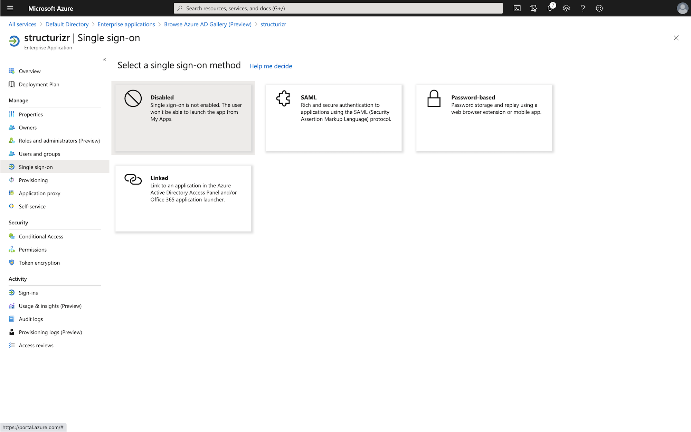
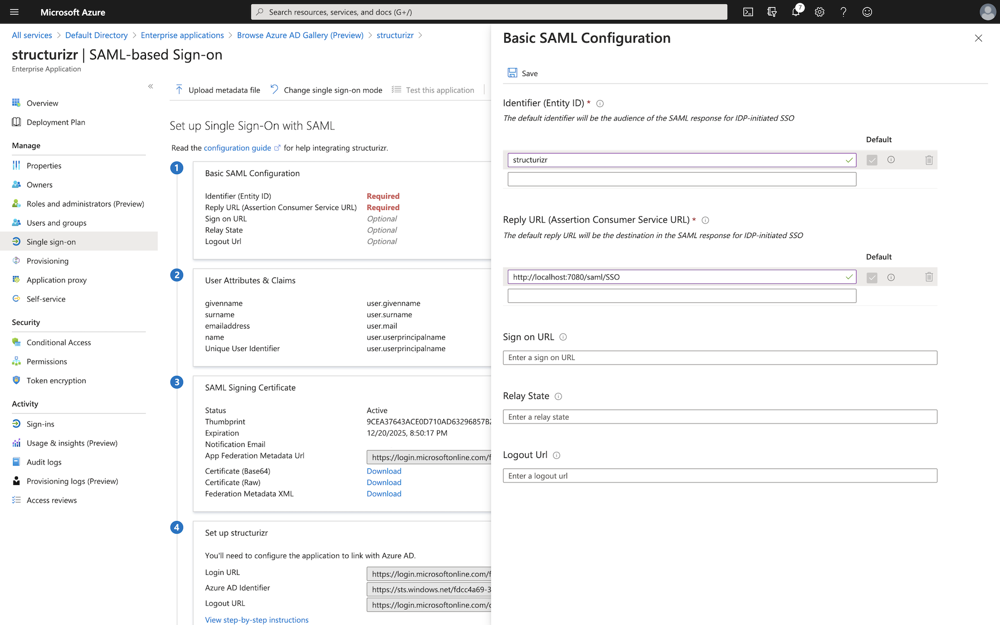
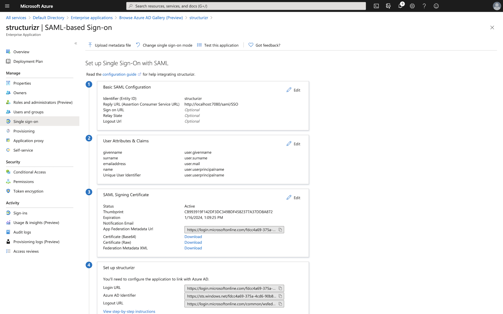
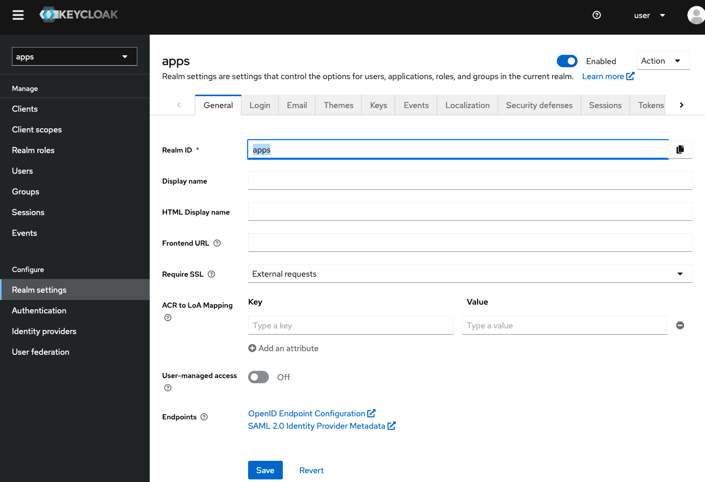
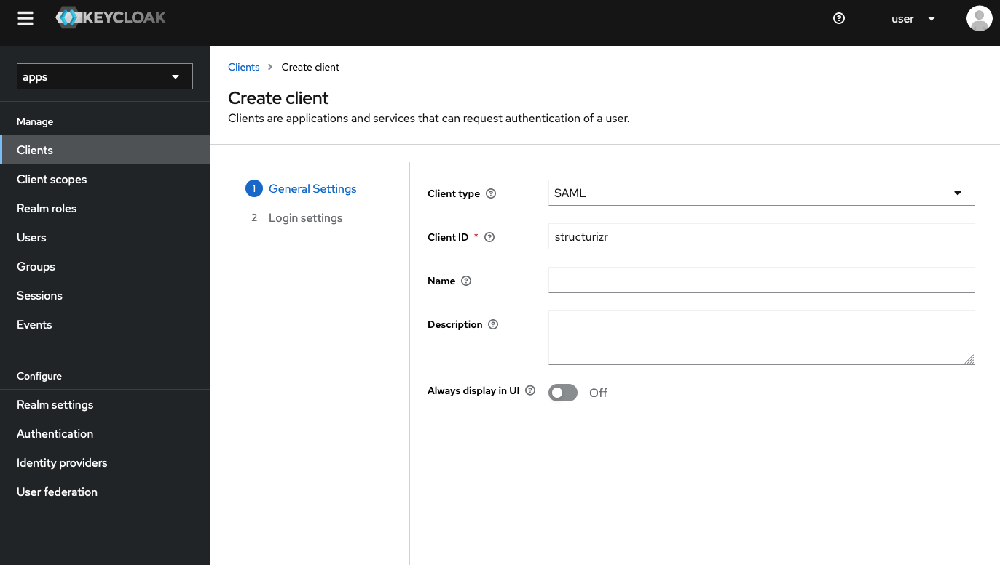
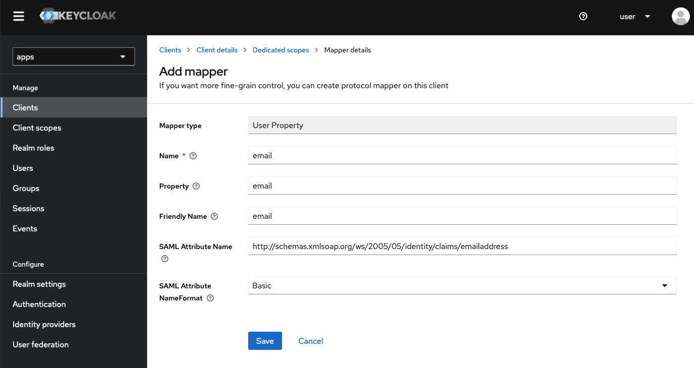
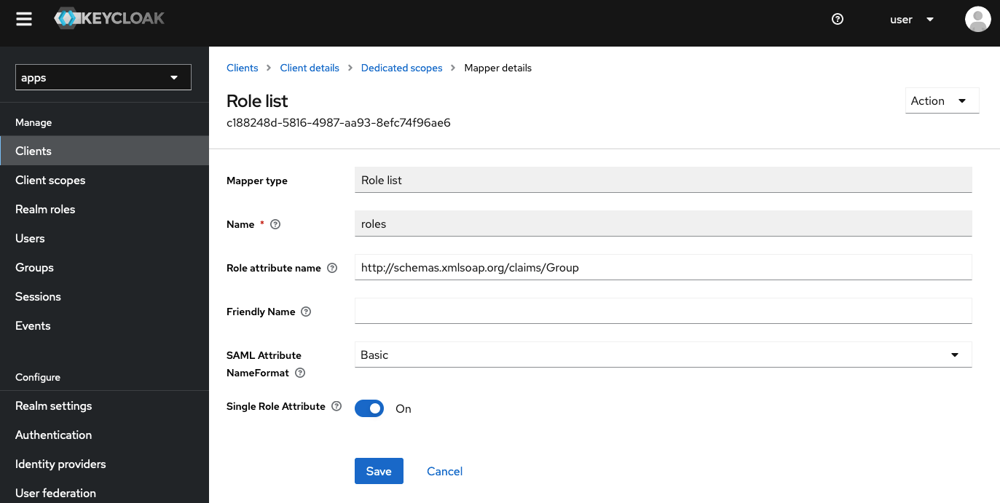

## Authentication

There are three variants of the on-premises installation, each with different authentication methods:

- [Form-based login, with a file-based user store](#local-file)
- [Form-based login, with integration to your LDAP server](#ldap)
- [Single sign-on with your Identity Provider via SAML 2.0](#saml-20)

### Local file

This variant is used by default, and configured to use a form-based login (username and password), with the set of users stored in a file called
`structurizr.users` in the Structurizr data directory (passwords are hashed using bcrypt).
A user with the username of `structurizr` and password of `password` is created by default.
You can add, remove or modify users as needed. Each line in this file should be in the following format:

```
{username}={hashed password}
```

A simple utility page is provided to calculate a bcrypt hashed password at `{structurizr.url}/bcrypt/{password}` (e.g. [http://localhost:8080/bcrypt/password](http://localhost:8080/bcrypt/password)).

It is also possible to configure a comma separated list of roles for every user, in a file called `structurizr.roles`, again in the Structurizr data directory.
Each line in this file should be in the following format:

```
{username}={role1},{role2},{role3}
```

### LDAP

A form-based login with integration to an LDAP server is supported, and this has been used successfully with FreeIPA and Microsoft Active Directory (via the LDAP binding). To configure LDAP integration:

- Add `structurizr.authentication=ldap` to your `structurizr.properties` file.
- Create a file named `ldap.xml` in your Structurizr data directory, based upon the following template. If you make any changes to this LDAP configuration file, you will need to restart the on-premises installation.

```
<beans:beans
xmlns="http://www.springframework.org/schema/security"
xmlns:beans="http://www.springframework.org/schema/beans"
xmlns:xsi="http://www.w3.org/2001/XMLSchema-instance"
xsi:schemaLocation="
http://www.springframework.org/schema/beans http://www.springframework.org/schema/beans/spring-beans-4.0.xsd
http://www.springframework.org/schema/security http://www.springframework.org/schema/security/spring-security.xsd
">

<!-- add your LDAP configuration here -->

</beans:beans>
```

The [Spring - LDAP Authentication](https://docs.spring.io/spring-security/site/docs/5.0.x/reference/html/ldap.html) documentation explains how to configure
LDAP integration, but some example configurations are as follows.

##### FreeIPA

The FreeIPA demo server can be useful to test LDAP integration.

```
<ldap-server url="ldap://ipa.demo1.freeipa.org:389/dc=demo1,dc=freeipa,dc=org" />
<authentication-manager>
<ldap-authentication-provider
        user-search-base="cn=users,cn=accounts"
        user-search-filter="(uid={0})"
        group-search-base="cn=groups,cn=compat"
        group-search-filter="(memberUid={1})"
        role-prefix="ROLE_">
</ldap-authentication-provider>
</authentication-manager>
```

##### Microsoft Active Directory

This configuration can be used as a starting point for integrating with Microsoft Active Directory.
You will need to change the following values in the example below:

- `DC=mycompany,DC=local` (the search base x2)
- `ldap://127.0.0.1:389` (your LDAP URL)
- `MYCOMPANY\Administrator` (your LDAP username)
- `password` (your LDAP password)

```
<beans:bean id="ldapAuthProvider" class="org.springframework.security.ldap.authentication.LdapAuthenticationProvider">
    <beans:constructor-arg>
        <beans:bean class="org.springframework.security.ldap.authentication.BindAuthenticator">
            <beans:constructor-arg ref="contextSource"/>
            <beans:property name="userSearch" ref="userSearch"/>
        </beans:bean>
    </beans:constructor-arg>
    <beans:constructor-arg>
        <beans:bean class="org.springframework.security.ldap.userdetails.DefaultLdapAuthoritiesPopulator">
            <beans:constructor-arg index="0" ref="contextSource"/>
            <beans:constructor-arg index="1" value="DC=mycompany,DC=local"/>
            <beans:property name="groupSearchFilter" value="(member={0})"/>
            <beans:property name="ignorePartialResultException" value="true"/>
            <beans:property name="searchSubtree" value="true"/>
        </beans:bean>
    </beans:constructor-arg>
</beans:bean>

<beans:bean id="userSearch" class="org.springframework.security.ldap.search.FilterBasedLdapUserSearch">
    <beans:constructor-arg index="0" value="DC=mycompany,DC=local"/>
    <beans:constructor-arg index="1" value="(sAMAccountName={0})"/>
    <beans:constructor-arg index="2" ref="contextSource" />
</beans:bean>

<beans:bean id="contextSource" class="org.springframework.security.ldap.DefaultSpringSecurityContextSource">
    <beans:constructor-arg value="ldap://127.0.0.1:389"/>
    <beans:property name="userDn" value="MYCOMPANY\Administrator"/>
    <beans:property name="password" value="password"/>
</beans:bean>

<authentication-manager>
    <authentication-provider ref="ldapAuthProvider" />
</authentication-manager>
```

### SAML 2.0

Single sign-on is supported via SAML 2.0 integration with an Identity Provider.
There are teams using this in conjunction with Auth0, Okta, Keycloak, PingFederate, and Microsoft Azure Active Directory.
To configure SAML integration:

- Add `structurizr.authentication=saml` to your `structurizr.properties` file.
- The `structurizr.url` property in the `structurizr.properties` file should be set to the URL where Structurizr is installed (e.g. `http://localhost:8080`).
- Register the Structurizr on-premises application with your Identity Provider. When doing this, you will need a "Reply URL", which is of the form `{structurizr.url}/saml/SSO` (e.g. `http://localhost:8080/saml/SSO`).
- Add a `structurizr.saml.entityId` property to your `structurizr.properties` file, set to the SAML Entity ID that you are using to identify the Structurizr on-premises installation (configured with your Identity Provider when setting up the application/client in the previous step).
- A copy of your Identity Provider's SAML metadata (XML format) should be saved to a file called `saml-idp-metadata.xml` in your Structurizr data directory.
- Map the IdP username to a SAML attribute named `http://schemas.xmlsoap.org/ws/2005/05/identity/claims/emailaddress`
- Map the IdP roles/groups to a SAML attribute named `http://schemas.xmlsoap.org/claims/Group`

If you make any changes to the SAML configuration, you will need to restart the on-premises installation.

#### Max authentication age

By default, Spring Security checks that you've been authenticated with your IdP within the past 2 hours (7200 seconds).
If this value is too low, you can override it via a property named `structurizr.saml.maxAuthenticationAge` in your `structurizr.properties` file (the value is the number of seconds, e.g. 86400 seconds for 24 hours).

Here are some guides that show how to integrate with different identity providers.

#### Auth0

Here are some basic instructions for integration with Auth0. In this example, the Structurizr on-premises installation was running at `http://localhost:7080`.

| Step | Description |
| ---- | ----------- |
| 1. Register the Structurizr on-premises installation |  Create an Auth0 "application" to represent the Structurizr on-premises installation. The "name" you use here should be set as the `structurizr.saml.entityId` property in your `structurizr.properties` file.  |
| 2. Set the callback URL | After creation, you will need to change the allowed callback URLs setting to `http://localhost:7080/saml/SSO`.  |
| 3. Download IdP metadata | Click the "SAML2 webapp" add-on for the application, and download the SAML metadata by clicking the "Identity Provider Metadata: Download" link, saving this as `saml-idp-metadata.xml` in your Structurizr data directory.  |

#### Azure Active Directory

Here are some basic instructions for integration with Azure Active Directory. In this example, the Structurizr on-premises installation was running at `http://localhost:7080`.
See [SSO :: 500 Error after initial authentication](https://github.com/structurizr/onpremises/issues/8) if your SAML integration stops working after a short period of time.
You may need to change the [max authentication age](#max-authentication-age).

| Step | Description |
| ---- | ----------- |
| 1. Register the Structurizr on-premises installation | Create an Azure "enterprise application" to represent the Structurizr on-premises installation. Choose the "Integrate with any other application you don't find in the gallery" option.  |
| 2. Change the SSO method to SAML |   |
| 3. Configure SAML | The "identifier" you use here should be set as the `structurizr.saml.entityId` property in your `structurizr.properties` file. And the "reply URL" should be set to `http://localhost:7080/saml/SSO`.  |
| 4. Download IdP metadata | Download the IdP metadata from the "App Federation Metadata URL" link, saving this as `saml-idp-metadata.xml` in your Structurizr data directory.  |

#### Keycloak

Here are some basic instructions for integration with Keycloak. In this example, the Structurizr on-premises installation was running at `http://localhost:7080`, and a realm already existed.

| Step | Description |
| ---- | ----------- |
| 1. Download IdP metadata | Find the realm that you would like authenticate against, and download the SAML metadata by clicking the "SAML 2.0 Identity Provider Metadata" link, saving this as `saml-idp-metadata.xml` in your Structurizr data directory.  |
| 2. Register the Structurizr on-premises installation | Create a Keycloak "client" to represent the Structurizr on-premises installation. The "client ID" you use here should be set as the `structurizr.saml.entityId` property in your `structurizr.properties` file.  |
| 3. Configure SAML | After creation, set "Client Signature Required" to `Off` (otherwise you'll see an "Invalid requester" message) and "Valid Redirect URIs" to `http://localhost:7080/saml/*` (otherwise you'll see an "Invalid redirect URI" message).
| 4. Add user property mappers | At this point, the integration should be functional, although you won't see the username and groups/roles associated with the user. To do that, you need to add a couple of mappings for the client - one for the username, and one for the groups/roles.   |